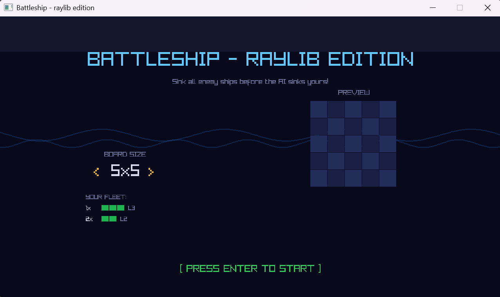
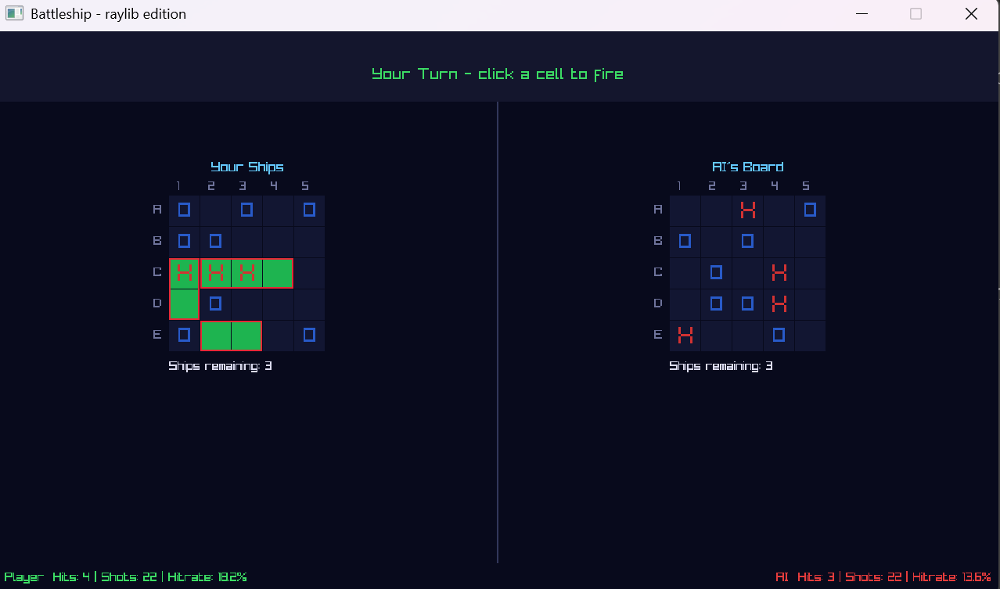
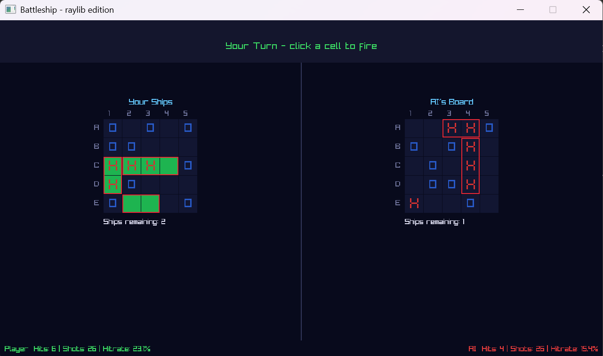
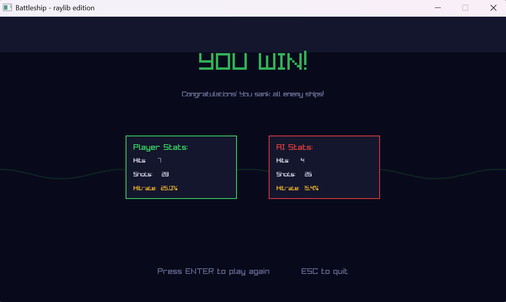

# Battleship — Raylib Edition

A graphical Battleship game built in C++ using the raylib library. Play against an AI opponent that uses a Hunt & Target algorithm to systematically sink your fleet. Ships are placed randomly, the board size is configurable, and the game tracks hit rates for both sides.

---

## Demo-Video


---

## Screenshots

### Menu Screen


### Game Screen


### Sunk Ship


### Game Over Screen


---

## Download & Play

Download the latest release from the [Releases](https://github.com/mhajok-dev/Battleship-RaylibEdition/releases) page.
Extract the ZIP and run `CPP_BattleShip.exe` — no installation required.

## Building from Source
This project uses **Visual Studio 2022** (.sln).
1. Clone the repo.
2. Download **raylib 5.5** (Windows MSVC version).
3. Place the `include` and `lib` folders into `Dependencies/raylib/`.
4. Open `CPP_BattleShip.sln` and build for **x64 Release**.

---

## Features

- Configurable board size from 5×5 up to 15×15 — fleet scales automatically
- AI opponent with Hunt & Target algorithm
- Ships placed randomly at the start of every game
- Hit, Miss and Sunk sound effects — distinct audio feedback for each outcome
- Screen shake on hit and sunk
- Sunk ships on the AI board are outlined so you can track your progress
- Live hit rate stats for both player and AI
- Animated menu and game over screen with wave effects
- Full game state machine: Menu → Player Turn → AI Turn → Game Over

---

## How to Play

Use arrow keys on the menu screen to change the board size, then press **Enter** to start. Click any cell on the AI's board to fire. The AI responds automatically after a short delay. Sink all enemy ships before the AI sinks yours. On the game over screen, press **Enter** to play again or **ESC** to quit.

| Symbol | Meaning |
|--------|---------|
| `X` *(red)* | Hit |
| `O` *(blue)* | Miss |
| Red outline | Sunken ship |
| Green cells | Your ships |

---

## AI — Hunt & Target Algorithm

The AI operates in two modes. In **Hunt mode** it fires at random cells it has not yet targeted. When it scores a hit it switches to **Target mode** and systematically works through the adjacent cells of the hit until the ship is sunk, then clears the queue and returns to Hunt mode.

```cpp
std::string AIPlayer::MakeMove()
{
    Coordinate coord;

    if (!m_targetCells.empty())
    {
        // Target mode: work through adjacent cells of a previous hit
        coord = m_targetCells.front();
        m_targetCells.erase(m_targetCells.begin());
    }
    else
    {
        // Hunt mode: shoot randomly
        coord = GetHuntModeMove();
    }

    UpdateMoveHistory(coord.row, coord.column);
    return CoordinateToString(coord);
}
```

---

## Project Structure

```
CPP_BattleShip/
├── screenshots/
├── CPP_BattleShip.cpp       # Entry point — window setup and game loop
└── src/
    ├── Game.cpp / Game.h    # Game state machine, turn logic, ship placement
    ├── Settings.h           # Central compile-time constants (window, board, timing)
    ├── Colors.h             # All game colors as named raylib Color structs
    ├── audio/
    │   ├── AudioManager.cpp / .h    # Music and sound effect management (RAII)
    ├── core/
    │   ├── Ship.h                   # Ship data and OccupiesCell / IsSunk logic
    │   ├── Board.cpp / .h           # Board state, ship list, shot tracking
    │   ├── Player.cpp / .h          # Abstract base class for all player types
    │   ├── HumanPlayer.cpp / .h     # Mouse-driven player
    │   ├── AIPlayer.cpp / .h        # Hunt & Target AI
    │   └── Types.h                  # Shared data types (Coordinate, ShotResult)
    ├── rendering/
    │   ├── Renderer.cpp / .h        # All drawing via raylib, screen shake
    └── validation/
        ├── InputValidator.cpp / .h  # Move and board size validation
```

Each class has exactly one responsibility — this follows the **Single Responsibility Principle (SRP)**.

---

## OOP Concepts

### Abstract base class & polymorphism

All player types inherit from `Player`, which defines the shared interface. `MakeMove()` is pure virtual — `Game` calls it without knowing whether it is talking to a human or the AI.

```cpp
class Player
{
public:
    virtual std::string MakeMove() = 0;
    void UpdateMoveHistory(int row, int column);
    [[nodiscard]] bool IsValidMove(int row, int column) const;
    [[nodiscard]] Board* GetBoard() const { return m_pBoard.get(); }

protected:
    std::unique_ptr<Board> m_pBoard = nullptr;
    std::vector<std::vector<bool>> m_moveHistory = {};
};
```

`HumanPlayer` stores a pending move set by the mouse handler. `AIPlayer` computes its own move via the Hunt & Target algorithm. Both are interchangeable from `Game`'s perspective.

### RAII — resource ownership

`Player` owns its `Board` via `unique_ptr` — no manual delete, no memory leak possible. `AudioManager` follows the same pattern: it loads all audio resources in the constructor and unloads them in the destructor.

```cpp
AudioManager::AudioManager()
{
    InitAudioDevice();
    LoadSounds();
}

AudioManager::~AudioManager()
{
    StopMusic();
    UnloadSounds();
    CloseAudioDevice();
}
```

### State machine

The game flow is controlled by a `GameState` enum. `Game::Update()` dispatches to the correct handler each frame. Adding a new state only requires a new enum value and a new case — no existing logic needs to change.

```cpp
enum class GameState : uint8_t
{
    MENU,
    PLAYER_TURN,
    AI_TURN,
    GAME_OVER
};
```

### Separation of concerns (SRP)

| Class | Responsibility |
|-------|---------------|
| `Game` | State machine, turn flow, ship placement |
| `Board` | Board data, ship list, shot tracking |
| `Renderer` | All drawing — no game logic |
| `AudioManager` | Audio loading and playback |
| `InputValidator` | Coordinate and board size validation |
| `AIPlayer` | Hunt & Target move generation |
| `Settings` | Compile-time constants |
| `Colors` | Named color definitions |

### DRY — ApplyShot

Both the player turn and the AI turn need to evaluate a shot, update the board, and determine the outcome. This logic is extracted into a single private method that returns a `ShotResult` enum. Neither `ProcessPlayerInput` nor `ProcessAITurn` duplicates the board mutation logic.

```cpp
enum class ShotResult { HIT, SUNK, MISS };

ShotResult Game::ApplyShot(Board& board, const int row, const int col)
{
    board.IncrementShotsFired();

    if (board.GetGameBoard()[row][col] == 'S')
    {
        board.GetHiddenBoard()[row][col] = 'X';
        board.GetGameBoard()[row][col]   = 'H';
        board.IncrementHits();

        Ship* pHitShip = board.FindShipAtCell(row, col);
        if (pHitShip != nullptr)
        {
            pHitShip->m_hits++;
            if (pHitShip->IsSunk())
            {
                board.DecrementRemainingShips();
                m_renderer.TriggerShake(10.0f, 0.4f);
                return ShotResult::SUNK;
            }
        }
        m_renderer.TriggerShake(6.0f, 0.25f);
        return ShotResult::HIT;
    }

    board.GetHiddenBoard()[row][col] = 'O';
    return ShotResult::MISS;
}
```

### Encapsulation

`Board` exposes named mutator methods instead of mutable references. This means `Board` controls how its own state changes — external code cannot set `m_shotsFired` to an arbitrary value.

```cpp
// Instead of: int& GetShotsFired() { return m_shotsFired; }
void IncrementShotsFired()     { m_shotsFired++;     }
void IncrementHits()           { m_hits++;           }
void DecrementRemainingShips() { m_shipsRemaining--; }
```

---

## Audio

| File | Usage |
|------|-------|
| `menu_bgm.mp3` | Soft ambient ocean sound on the menu screen |
| `game_bgm.mp3` | Atmospheric combat music during gameplay |
| `endscreen.mp3` | Underwater ambience on the game over screen — implies sunk |
| `hit.mp3` | Cannon shot on a direct hit |
| `miss.mp3` | Water splash on a miss |

The sunk sound reuses `hit.mp3` with a lower pitch and higher volume for a more imposing effect.

---

## Tech Stack

- **Language:** C++ (C++17)
- **Graphics / Audio:** [raylib](https://www.raylib.com/)
- **IDE:** JetBrains Rider
- **Build:** MSVC, x64
